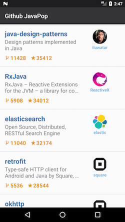
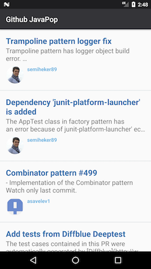

# 3º Desafio Android

## Descrição Geral

Desafio técnico da empresa Concrete.

 

## Descrição técnica

### Resumo
Na solução para este app, propus a utilização de RxJava, em conjunto com a proposta do Android Architecture Components (AAC), recomendada pelo Google.

Ambas utilizam o conceito de "reativo". Porém AAC faz uso da vantagem de livrar o desenvolvedor das preocupações do ciclo de vida da aplicação em Android.
Conseqüentemente, para lógica entre View e Model, utilizei AAC.

Para a lógica de chamadas ao repositório HTTP e ao repositório em DB cacheado, utilizei RxJava + RxAndroid.


### Principais bibliotecas
- `android.arch.lifecycle`: Usei componentes como Mutable Live Data e ViewModel que ajudam a representar o Model e a unir esta à view, mantendo o estado dos componentes ao longo do ciclo de vida da activity ou fragment. Também utilizamos o recurso de ouvir à mudanças no Model de modo que podemos refletir as mudanças na View correspondente. Link: https://developer.android.com/topic/libraries/architecture/

- `android.arch.paging`: Usei componentes responsáveis por gerenciar a lógica de paginação e que é totalmente integrada com `android.arch.lifecycle`. Link: https://developer.android.com/topic/libraries/architecture/paging/.

- `com.github.Raizlabs.DBFlow`: Biblioteca requisitada no desafio para facilitar a construção de DB do SQLite para cache. Link: https://github.com/Raizlabs/DBFlow

- `com.squareup.retrofit2`: Biblioteca para interfacemento com APIs Web sob protocolo HTTP. Link: http://square.github.io/retrofit/

- `io.reactivex.rxjava2`: Bilioteca que permite realizar uma programação assíncrona em Java. Link: https://github.com/ReactiveX/RxJava

Adaptei soluções de:
- https://github.com/eclipse/egit-github/blob/master/org.eclipse.egit.github.core/src/org/eclipse/egit/github/core/client/PageLinks.java

### Itens não implementados

- **Testes unitários**
- **Cache de imagens**
    - Deixou-se apenas a política padrão de cache em memória e em disco da biblioteca Picasso.
- **minAPI 15**
    - Consegui fazer funcionar para minAPI 16. Motivo: API 15 não tem suporte nativo para tls "TLSv1.2" nos protocolos de conexões de socket. Por motivos de segurança, a API do Github não aceita versões defasadas e inseguras. Fonte: https://developer.github.com/changes/2018-02-01-weak-crypto-removal-notice/

### Possíveis melhorias

- Considerando o crescimento do app, seria interessante utilizar "injeção de dependência" ou "service locator" para as variáveis referentes ao repositório, de onde as informação são carregadas. Isso facilitaria o isolamento das classes e, consequentemente, os testes unitários e instrumentados.
- Tratamento de erros em caso de falha na conexão. Exemplo: carregar uma das páginas novamente em caso de restabelecimento de conexão, ou caso o usuário solicite recarregar.


## Testes

Os testes utilizam o buildtype ```instrumentation``` para rodar, pois nessa build forçamos que o app seja buildado para apontar para localhost com porta fixa durante os testes.
